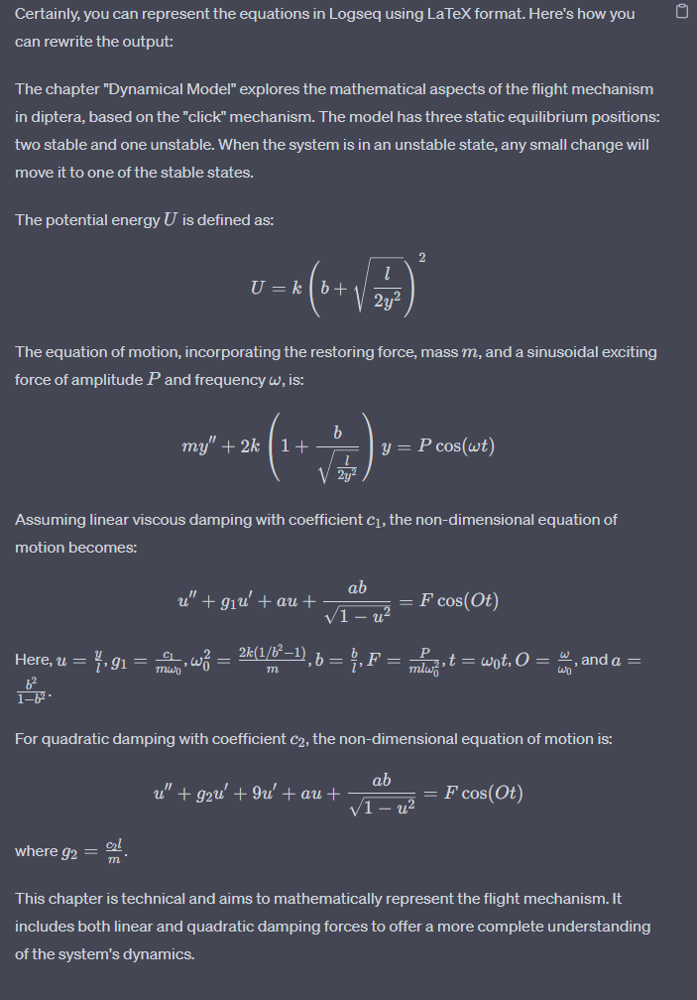
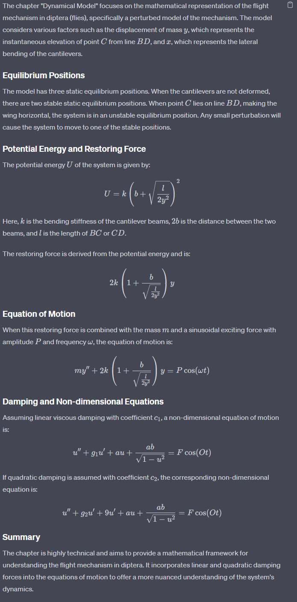
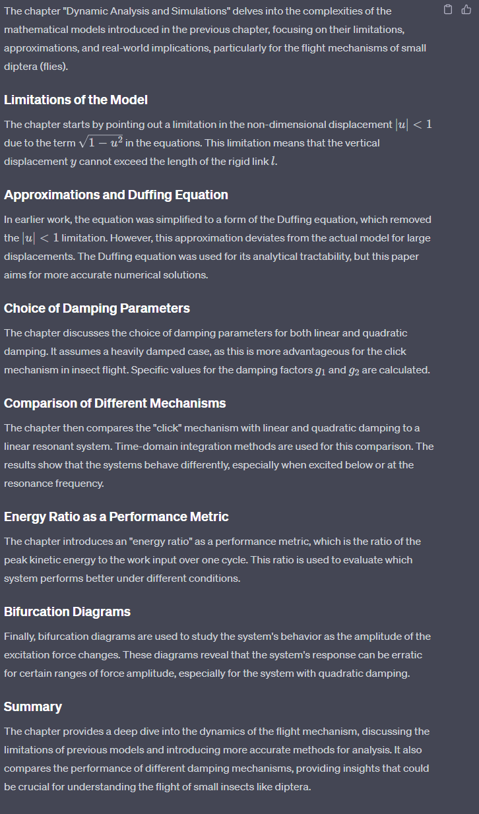

- Sada analiziramo tangov 2011
	-  [[Master rad]] [[Tang 2011]]
		- The Tang2011 PDF analizira dinamičko ponašanje "klik" mehanizma u letu dvokrilaca. Detaljno ispituje mehanizam i istražuje efekte različitih modela prigušenja. Rad raspravlja o matematičkom modelu koji je korišćen, o odnosu energije, kao i o bifurkaciji mehanizma.
	- Članak 1 se bavi proučavanjem mehanizma leta diptera (muva), fokusirajući se na model poznat kao "klik" mehanizam. Ovaj model je ranije razmatran i prihvaćen od strane nekih istraživača kao reprezentativan za stvarni mehanizam leta kod muva. Članak ima za cilj da nadogradi rad Brennana i saradnika iz 2003. godine, koji su predložili jednostavan mehanički model "klik" mehanizma. Model uključuje različite komponente kao što su skutelarni polugom, kantileverske grede i šarke koje predstavljaju različite delove anatomije insekta uključene u let.
		- Rad takođe ponovo razmatra dve glavne pretpostavke napravljene u radu Brennana i saradnika: 1) da se energetski gubitak zbog sila podizanja i otpora može predstaviti linearnim viskoznim prigušivačem, i 2) da se jednačina kretanja može pojednostaviti na Duffingovu jednačinu. Članak ima za cilj da pruži tačniji opis dinamičkog ponašanja modela istražujući relativni uticaj linearnih i kvadratnih prigušivačkih sila. Za to koristi numeričke metode.
		- Pored toga, članak diskutuje uticaj rotacije tela i aerodinamičkih sila na let, posebno tokom brzih manevara okretanja. Napominje se da je prigušivačka sila zbog aerodinamike snažno uticajna na Rejnoldsov broj, koji varira na osnovu veličine i brzine insekta. Za male insekte, prigušivačka sila može ležati između linearnih i kvadratnih oblika.
		- 
	-
	- Chapter 3
	- 
	- 
	- The "Conclusions" chapter summarizes the key findings of the study, which investigated the "click" mechanism in the flight motor of small diptera (flies) to determine its advantages over a linear resonant system.
	- ### Key Points:
	- -
	- **Original Equation of Motion**: Unlike previous studies that used an approximate equation based on the Duffing equation, this study used the original equation of motion. This approach accounts for the physical limitations of the mechanism, such as the maximum response amplitude.
	- -
	- **Damping Mechanisms**: The study explored both linear and quadratic damping effects. Quadratic damping is particularly relevant when the damping is proportional to the square of the velocity of the wing, a situation that might occur at higher Reynolds numbers.
	- -
	- **Energy Ratio**: The study introduced an "energy ratio" as a performance metric, which is the ratio of the peak kinetic energy to the work input over one cycle of excitation. This ratio was used to compare the performance of different systems under various conditions.
	- -
	- **Performance Comparisons**:
	- When the "click" mechanism with linear damping is excited well below its resonance frequency, the energy ratio (and hence the wing velocity) increases with an increase in the amplitude of the excitation force.
		- This system outperforms both the same system excited at the resonance frequency and a linear resonant system.
		- The non-resonant system with quadratic damping outperforms the same system with linear damping.
	- -
	- **Implications for Larger Diptera**: The study suggests that the "click" mechanism could offer further advantages for larger diptera when the Reynolds number is high, making the damping due to air quadratic rather than linear.
	- In summary, the study concludes that the "click" mechanism offers advantages over a linear resonant system, especially when considering the effects of different types of damping. These findings could have implications for understanding the flight mechanisms of not just small but also larger diptera.